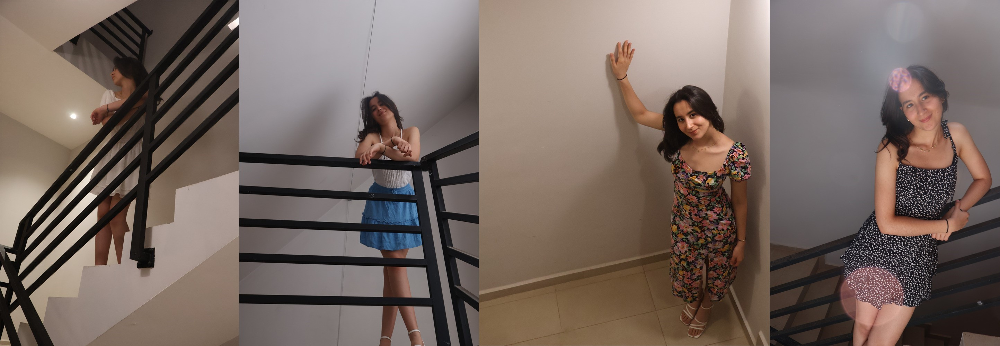
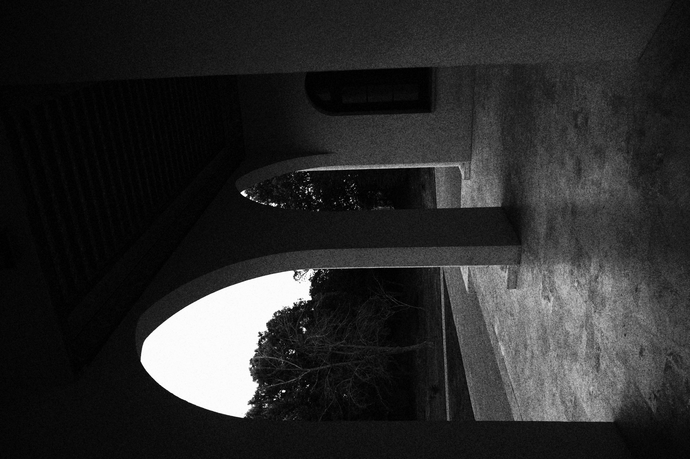
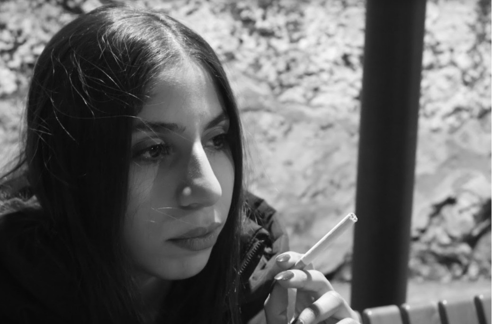
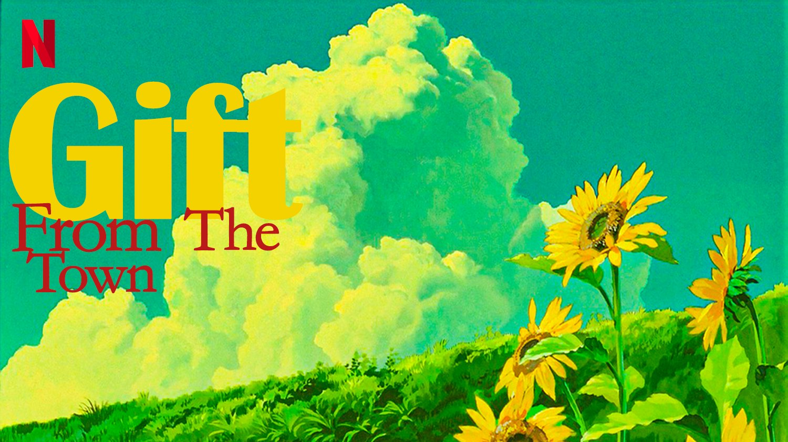
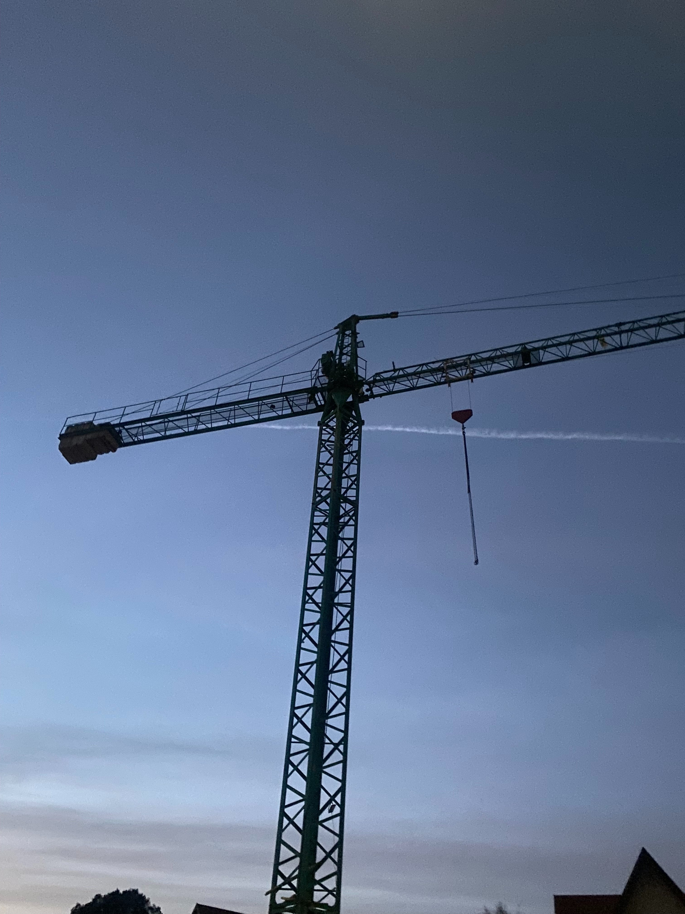

# 🎨 Hajar Mrabet – Creative Portfolio

This repository showcases selected works from my photography and graphic design courses as part of my Communication Studies minor. Each project reflects my efforts to blend creativity with visual storytelling and design technique.

---

## 📷 Photography

| Title | Preview |
|-------|---------|
| **Balance** |  |
| **Spring** |  |
| **Frame** |  |
| **Framing** |  |
| **Focus** |  |
| **IMG 1346** |  |

---

## 🎨 Graphic Design

| Title | Preview |
|-------|---------|
| **Netflix Poster** |  |
| **LIFE OF PII** |  |
| **MAG7 Poster** |  |
| **SUITS Poster** |  |
| **TENNIS Poster** |  |
| **Girl Tutorial** |  |
| **Blue Poster** |  |
| **1-Modified** |  |
| **Midterm Submission** |  |

---

## 📄 PDFs & Other Documents

- [Hajar.pdf](Hajar.pdf)
- [Waste of Energy (Poster)](waste%20of%20energy.pdf)
- [Cover Design](cover%20%5BRecovered%5D%20copy.pdf)

---

## 🧠 Tools Used

- Adobe Photoshop
- Adobe Illustrator
- Adobe InDesign
- Figma

---

> 💡 To view high-resolution versions of the artworks, click on each image or check the PDF files listed above.
